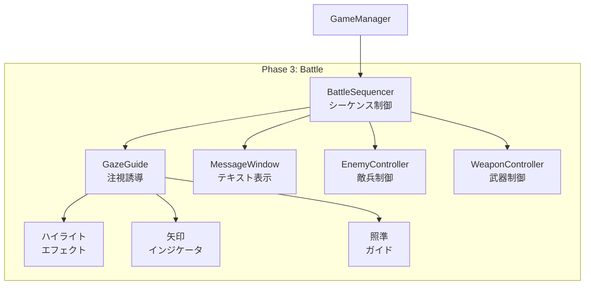
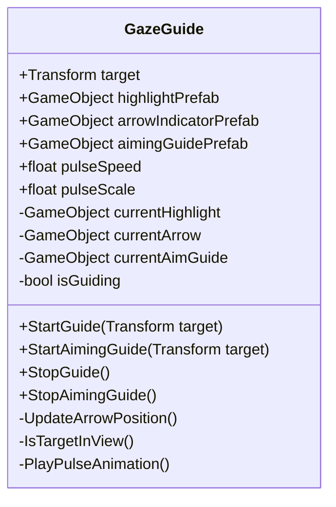
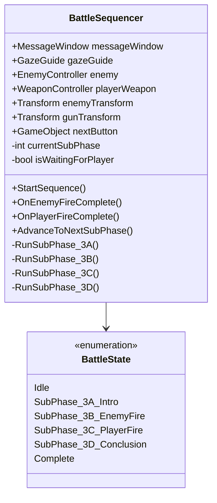
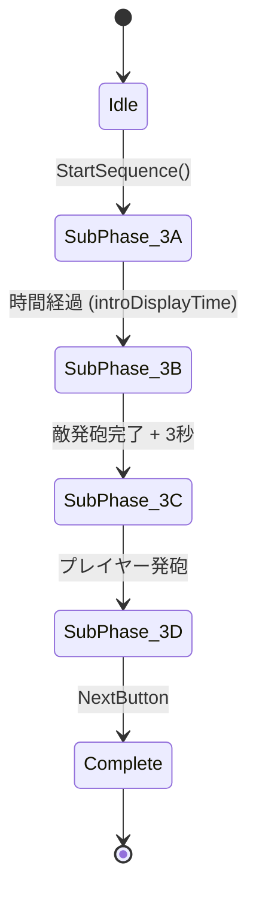

# システム設計書：注視誘導・イベントシーケンスシステム

> **実装状態**: 📝 設計中  
> **旧名称**: GazeGuide_BattleSequencer.md  
> **今後の方向**: BattleSequencer を汎用 EventSequencer に発展予定

## 1. 概要

本ドキュメントでは、Phase 3（戦闘フェーズ）で使用する2つの連携システムを設計する。

> [!NOTE]
> 今後、BattleSequencer は **EventSequencer** として汎用化し、Phase 2 (Strategy) など他のフェーズでも再利用可能な設計に変更予定。

| システム | 役割 |
|---------|------|
| **GazeGuide** | プレイヤーの視線を重要なオブジェクトに誘導する |
| **EventSequencer** (旧: BattleSequencer) | フェーズ内のサブシーケンスを順序制御する |

---

## 2. システム関係図



---

# Part 1: GazeGuide（注視誘導システム）

## 3. GazeGuide 概要

### 3.1. 目的
プレイヤーが**見るべきもの**を明確に示し、教育的に重要な瞬間を見逃させない。

### 3.2. 誘導手法

| 手法 | 説明 | 使用シーン |
|------|------|-----------|
| **ハイライト** | 対象オブジェクトの輪郭を光らせる | 銃、敵兵の強調 |
| **矢印インジケータ** | 視界外の対象への方向を示す | 敵が視界外にいる時 |
| **照準ガイド** | 敵の位置に照準マーカーを表示 | 発砲を促す時 |
| **パルスアニメ** | 対象を拡大縮小で目立たせる | 注目すべき瞬間 |

---

## 4. GazeGuide クラス設計

### 4.1. クラス図



### 4.2. パブリックプロパティ

| プロパティ | 型 | 説明 | デフォルト値 |
|-----------|------|------|--------------| 
| `target` | Transform | 現在の注視対象 | null |
| `highlightPrefab` | GameObject | ハイライトエフェクトのプレハブ | - |
| `arrowIndicatorPrefab` | GameObject | 矢印UIのプレハブ | - |
| `aimingGuidePrefab` | GameObject | 照準ガイドのプレハブ | - |
| `pulseSpeed` | float | パルスアニメーションの速度 | 2.0 |
| `pulseScale` | float | パルスの最大拡大率 | 1.2 |
| `viewAngleThreshold` | float | 視界内判定の角度閾値（度） | 60.0 |

### 4.3. パブリックメソッド

```csharp
/// <summary>
/// 指定したオブジェクトへの注視誘導を開始する
/// ハイライト表示 + 視界外なら矢印表示
/// </summary>
public void StartGuide(Transform newTarget)

/// <summary>
/// 照準ガイドを表示する（発砲を促す時用）
/// </summary>
public void StartAimingGuide(Transform newTarget)

/// <summary>
/// 注視誘導を停止する
/// </summary>
public void StopGuide()

/// <summary>
/// 照準ガイドのみ停止する
/// </summary>
public void StopAimingGuide()
```

---

## 5. GazeGuide 実装詳細

### 5.1. ハイライト表示

```csharp
public void StartGuide(Transform newTarget)
{
    target = newTarget;
    isGuiding = true;

    // ハイライトエフェクトを対象にアタッチ
    if (highlightPrefab != null && currentHighlight == null)
    {
        currentHighlight = VRCInstantiate(highlightPrefab);
        currentHighlight.transform.SetParent(target);
        currentHighlight.transform.localPosition = Vector3.zero;
    }
}
```

### 5.2. 視界外判定と矢印表示

```csharp
private void LateUpdate()
{
    if (!isGuiding || target == null) return;

    // 視界内かどうかを判定
    if (!IsTargetInView())
    {
        ShowArrowIndicator();
    }
    else
    {
        HideArrowIndicator();
    }

    // パルスアニメーション
    PlayPulseAnimation();
}

private bool IsTargetInView()
{
    VRCPlayerApi player = Networking.LocalPlayer;
    if (player == null) return false;

    var headData = player.GetTrackingData(VRCPlayerApi.TrackingDataType.Head);
    Vector3 headPos = headData.position;
    Vector3 headForward = headData.rotation * Vector3.forward;

    Vector3 toTarget = (target.position - headPos).normalized;
    float angle = Vector3.Angle(headForward, toTarget);

    return angle <= viewAngleThreshold;
}
```

### 5.3. 矢印インジケータの位置計算

```csharp
private void UpdateArrowPosition()
{
    if (currentArrow == null || target == null) return;

    VRCPlayerApi player = Networking.LocalPlayer;
    var headData = player.GetTrackingData(VRCPlayerApi.TrackingDataType.Head);

    // 対象への方向をスクリーン座標に変換
    Vector3 toTarget = target.position - headData.position;
    Vector3 screenDirection = Vector3.ProjectOnPlane(toTarget, headData.rotation * Vector3.forward);
    screenDirection = headData.rotation * screenDirection;

    // 矢印を画面端に配置
    float edgeDistance = 0.8f; // 画面端からの距離
    currentArrow.transform.position = headData.position 
        + headData.rotation * Vector3.forward * 1.5f
        + screenDirection.normalized * edgeDistance;

    // 矢印を対象の方向に向ける
    currentArrow.transform.LookAt(target);
}
```

### 5.4. 照準ガイド

```csharp
public void StartAimingGuide(Transform newTarget)
{
    target = newTarget;

    if (aimingGuidePrefab != null && currentAimGuide == null)
    {
        currentAimGuide = VRCInstantiate(aimingGuidePrefab);
    }

    // 照準ガイドは対象の位置に固定表示
    if (currentAimGuide != null)
    {
        currentAimGuide.transform.position = target.position;
        currentAimGuide.SetActive(true);
    }
}
```

---

## 6. GazeGuide エフェクト仕様

### 6.1. ハイライトエフェクト

| 項目 | 仕様 |
|------|------|
| 見た目 | オブジェクトの輪郭を光らせる（アウトラインシェーダー or 発光パーティクル） |
| 色 | 黄色〜オレンジ系（注意を引く色） |
| アニメーション | ゆっくりパルス（点滅ではなく明度変化） |

### 6.2. 矢印インジケータ

| 項目 | 仕様 |
|------|------|
| 見た目 | シンプルな三角形の矢印（視点追従UI） |
| 配置 | 画面端、対象の方向を示す |
| 色 | 白〜黄色（背景を問わず見える） |
| アニメーション | 対象方向へバウンスアニメーション |

### 6.3. 照準ガイド

| 項目 | 仕様 |
|------|------|
| 見た目 | 円形の照準マーカー（十字線 or リング） |
| 配置 | 対象（敵兵）のワールド座標に固定 |
| 色 | 赤〜オレンジ（攻撃対象を示す） |
| アニメーション | 収縮アニメーション（照準が絞られる演出） |

---

# Part 2: BattleSequencer（戦闘シーケンス制御）

## 7. BattleSequencer 概要

### 7.1. 目的
Phase 3 のサブフェーズ（3-A〜3-D）を**順序通りに進行**させ、各フェーズで適切なシステムを呼び出す。

### 7.2. サブフェーズ一覧

| サブフェーズ | 名称 | トリガー | 次への条件 |
|-------------|------|----------|-----------|
| 3-A | 導入・配置説明 | Phase 3 開始 | 一定時間経過 or ボタン |
| 3-B | 敵兵の発砲 | 3-A 完了 | 敵が発砲完了 |
| 3-C | プレイヤーの発砲 | 3-B 完了 | プレイヤーが発砲 |
| 3-D | まとめ解説 | 3-C 完了 | NextButton |

---

## 8. BattleSequencer クラス設計

### 8.1. クラス図



### 8.2. パブリックプロパティ

| プロパティ | 型 | 説明 |
|-----------|------|------|
| `messageWindow` | MessageWindow | テキスト表示用UI |
| `gazeGuide` | GazeGuide | 注視誘導システム |
| `enemy` | EnemyController | 敵兵の制御 |
| `playerWeapon` | WeaponController | プレイヤーの武器 |
| `enemyTransform` | Transform | 敵兵の位置 |
| `gunTransform` | Transform | プレイヤーの銃の位置 |
| `nextButton` | GameObject | 次へボタン |
| `introDisplayTime` | float | 3-A の表示時間（秒） |

### 8.3. コールバックメソッド

```csharp
/// <summary>
/// 敵の発砲が完了した時に呼び出される（EnemyControllerから）
/// </summary>
public void OnEnemyFireComplete()

/// <summary>
/// プレイヤーが発砲した時に呼び出される（WeaponControllerから）
/// </summary>
public void OnPlayerFireComplete()
```

---

## 9. BattleSequencer 実装詳細

### 9.1. シーケンス開始

```csharp
public void StartSequence()
{
    currentSubPhase = 0;
    nextButton.SetActive(false);
    messageWindow.SetMode(0); // Always On
    
    RunSubPhase_3A();
}
```

### 9.2. サブフェーズ 3-A: 導入

```csharp
private void RunSubPhase_3A()
{
    currentSubPhase = 1;
    
    // 銃をハイライト
    gazeGuide.StartGuide(gunTransform);
    
    // 導入テキスト
    messageWindow.ShowMessage(
        "あなたは山道の物陰に潜んでいます。\n手元には最新式のミニエー銃があります。"
    );
    
    // 一定時間後に次へ進む
    SendCustomEventDelayedSeconds(nameof(AdvanceTo3B), introDisplayTime);
}

public void AdvanceTo3B()
{
    gazeGuide.StopGuide();
    RunSubPhase_3B();
}
```

### 9.3. サブフェーズ 3-B: 敵の発砲

```csharp
private void RunSubPhase_3B()
{
    currentSubPhase = 2;
    
    // 敵をハイライト（注視誘導）
    gazeGuide.StartGuide(enemyTransform);
    
    // テキスト表示
    messageWindow.ShowMessage("前方に敵兵を発見！");
    
    // 敵に発砲させる（一定時間後）
    SendCustomEventDelayedSeconds(nameof(TriggerEnemyFire), 2.0f);
}

public void TriggerEnemyFire()
{
    // 敵が発砲（EnemyControllerを呼び出す）
    enemy.FireAtPlayer();
    
    // 発砲後のテキスト
    messageWindow.ShowMessage(
        "敵が発砲しました！\nしかし火縄銃の射程は約50m。あなたまで届きません。"
    );
    
    // 一定時間後に次へ
    SendCustomEventDelayedSeconds(nameof(AdvanceTo3C), 3.0f);
}

public void OnEnemyFireComplete()
{
    // 弾が途中で落ちる演出が完了
}

public void AdvanceTo3C()
{
    RunSubPhase_3C();
}
```

### 9.4. サブフェーズ 3-C: プレイヤーの発砲

```csharp
private void RunSubPhase_3C()
{
    currentSubPhase = 3;
    isWaitingForPlayer = true;
    
    // 照準ガイドを表示
    gazeGuide.StartAimingGuide(enemyTransform);
    
    // 発砲を促すテキスト
    messageWindow.ShowMessage(
        "トリガーを引いて敵を狙ってください。\nミニエー銃の射程は約500m。この距離なら確実に届きます。"
    );
    
    // プレイヤーの発砲を待つ
    // WeaponController が発砲を検知したら OnPlayerFireComplete() が呼ばれる
}

public void OnPlayerFireComplete()
{
    if (!isWaitingForPlayer) return;
    isWaitingForPlayer = false;
    
    // 照準ガイドを消す
    gazeGuide.StopAimingGuide();
    
    // 命中演出
    enemy.TakeDamage();
    
    // 結果テキスト
    messageWindow.ShowMessage(
        "命中！\n500m離れた敵を倒すことができました。これがミニエー銃の力です。"
    );
    
    // 次へ
    SendCustomEventDelayedSeconds(nameof(AdvanceTo3D), 3.0f);
}

public void AdvanceTo3D()
{
    RunSubPhase_3D();
}
```

### 9.5. サブフェーズ 3-D: まとめ

```csharp
private void RunSubPhase_3D()
{
    currentSubPhase = 4;
    
    // 誘導を全て停止
    gazeGuide.StopGuide();
    gazeGuide.StopAimingGuide();
    
    // まとめテキスト
    messageWindow.ShowMessage(
        "この射程差こそが、長州軍が少数でも幕府軍に勝てた理由の一つです。\n敵は一方的に撃たれ、反撃すらできなかったのです。"
    );
    
    // 次へボタンを表示
    nextButton.SetActive(true);
}
```

---

## 10. シーケンス状態遷移図



---

## 11. 連携仕様

### 11.1. GameManager からの呼び出し

```csharp
// GameManager.cs
public BattleSequencer battleSequencer;

public void SetPhase(int nextIndex)
{
    // ... 既存処理 ...

    if (nextIndex == 2) // Phase 3: Battle
    {
        battleSequencer.StartSequence();
    }
}
```

### 11.2. WeaponController との連携

```csharp
// WeaponController.cs
public BattleSequencer battleSequencer; // インスペクターで設定

private void Fire()
{
    // ... 既存の発砲処理 ...

    // BattleSequencer に通知
    if (battleSequencer != null)
    {
        battleSequencer.SendCustomEvent("OnPlayerFireComplete");
    }
}
```

### 11.3. EnemyController との連携

```csharp
// EnemyController.cs
public BattleSequencer battleSequencer;

public void FireAtPlayer()
{
    // 発砲演出
    // ...

    // 弾が途中で落ちる演出
    // ...

    // 完了通知
    battleSequencer.SendCustomEvent("OnEnemyFireComplete");
}
```

---

## 12. Hierarchy構成

```
Phase3_Battle (GameObjectルート)
├── BattleSequencer (BattleSequencer.cs)
├── GazeGuide (GazeGuide.cs)
│   ├── HighlightPrefab (非アクティブ)
│   ├── ArrowIndicatorPrefab (非アクティブ)
│   └── AimingGuidePrefab (非アクティブ)
├── Enemy
│   └── EnemyController (EnemyController.cs)
├── PlayerSpawn
│   └── MinieRifle (WeaponController.cs)
├── MessageWindow (既存)
└── NextButton (非アクティブ)
```

---

## 13. テスト項目

### 13.1. GazeGuide テスト

| # | テスト項目 | 期待結果 |
|---|-----------|----------|
| 1 | StartGuide で対象がハイライトされるか | 対象の周囲に光のエフェクト |
| 2 | 視界外で矢印が表示されるか | 画面端に方向を示す矢印 |
| 3 | 視界内に入ると矢印が消えるか | ハイライトのみ残る |
| 4 | 照準ガイドが敵の位置に表示されるか | 敵の位置にマーカー |
| 5 | StopGuide で全てのエフェクトが消えるか | クリーンアップ完了 |

### 13.2. BattleSequencer テスト

| # | テスト項目 | 期待結果 |
|---|-----------|----------|
| 1 | StartSequence で 3-A が開始されるか | 銃ハイライト + 導入テキスト |
| 2 | 時間経過で 3-B に遷移するか | 敵ハイライト + 発砲 |
| 3 | 敵発砲後に 3-C に遷移するか | 照準ガイド + 発砲促進テキスト |
| 4 | プレイヤー発砲で 3-D に遷移するか | まとめテキスト + NextButton |
| 5 | 全体のシーケンスが途中で止まらないか | 完走確認 |

---

## 14. 実装スケジュール

| 週 | タスク |
|----|--------|
| Week 1 | GazeGuide 基本実装（ハイライト） |
| Week 2 | GazeGuide 追加機能（矢印、照準） |
| Week 3 | BattleSequencer 実装 |
| Week 4 | 連携テスト・調整 |

---

## 更新履歴

| 日付 | 内容 |
|------|------|
| 2026-01-18 | 初版作成 |
