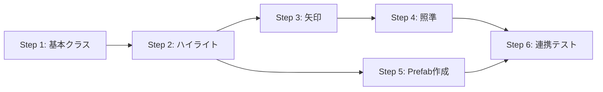

# GazeGuide 実装計画書

> **ステータス**: 📝 レビュー待ち  
> **対象ファイル**: `Assets/Scripts/UI/GazeGuide.cs`  
> **参照設計書**: [GazeGuide.md](file:///e:/development/University/Syuron/Docs/Components/GazeGuide.md)

---

## 実装ステップ概要

| Step | 内容 | 見積もり |
|------|------|----------|
| 1 | 基本クラス実装 | 30分 |
| 2 | ハイライト機能実装 | 1時間 |
| 3 | 矢印インジケータ実装 | 1時間 |
| 4 | 照準ガイド実装 | 30分 |
| 5 | エフェクト Prefab 作成 | 1時間 |
| 6 | 連携テスト | 30分 |

---

## Step 1: 基本クラス実装

### 目的
GazeGuide.cs の骨格を作成し、コンパイルが通る状態にする。

### 作業内容

#### 1.1 ファイル作成
- `Assets/Scripts/UI/GazeGuide.cs` を新規作成

#### 1.2 実装するコード

```csharp
using UdonSharp;
using UnityEngine;
using VRC.SDKBase;
using VRC.Udon;

/// <summary>
/// 注視誘導システム
/// プレイヤーの視線を重要なオブジェクトに誘導する
/// </summary>
public class GazeGuide : UdonSharpBehaviour
{
    [Header("エフェクトPrefab")]
    [Tooltip("ハイライトエフェクトのプレハブ")]
    public GameObject highlightPrefab;

    [Tooltip("矢印インジケータのプレハブ")]
    public GameObject arrowIndicatorPrefab;

    [Tooltip("照準ガイドのプレハブ")]
    public GameObject aimingGuidePrefab;

    [Header("アニメーション設定")]
    [Tooltip("パルスアニメーションの速度")]
    public float pulseSpeed = 2.0f;

    [Tooltip("パルスの最大拡大率")]
    public float pulseScale = 1.2f;

    [Tooltip("視界内判定の角度閾値（度）")]
    public float viewAngleThreshold = 60.0f;

    // 内部状態
    [HideInInspector] public Transform target;
    private GameObject currentHighlight;
    private GameObject currentArrow;
    private GameObject currentAimGuide;
    private bool isGuiding = false;
    private float pulseTimer = 0f;

    #region Public Methods

    /// <summary>
    /// 注視誘導を開始する
    /// </summary>
    public void StartGuide(Transform newTarget)
    {
        // Step 2 で実装
        Debug.Log($"[GazeGuide] StartGuide: {newTarget?.name}");
    }

    /// <summary>
    /// 照準ガイドを表示する
    /// </summary>
    public void StartAimingGuide(Transform newTarget)
    {
        // Step 4 で実装
        Debug.Log($"[GazeGuide] StartAimingGuide: {newTarget?.name}");
    }

    /// <summary>
    /// 注視誘導を停止する
    /// </summary>
    public void StopGuide()
    {
        // Step 2 で実装
        Debug.Log("[GazeGuide] StopGuide");
    }

    /// <summary>
    /// 照準ガイドを停止する
    /// </summary>
    public void StopAimingGuide()
    {
        // Step 4 で実装
        Debug.Log("[GazeGuide] StopAimingGuide");
    }

    /// <summary>
    /// すべてのガイドを停止する
    /// </summary>
    public void StopAll()
    {
        StopGuide();
        StopAimingGuide();
    }

    #endregion
}
```

### 完了条件
- [ ] ファイルが作成されている
- [ ] Unity でコンパイルエラーがない
- [ ] シーンの `[SYSTEM]` 配下に GazeGuide オブジェクトを追加
- [ ] スクリプトをアタッチ

---

## Step 2: ハイライト機能実装

### 目的
対象オブジェクトにハイライトエフェクトを表示し、パルスアニメーションで目立たせる。

### 作業内容

#### 2.1 StartGuide メソッド実装

```csharp
public void StartGuide(Transform newTarget)
{
    if (newTarget == null)
    {
        Debug.LogWarning("[GazeGuide] StartGuide: target is null");
        return;
    }

    target = newTarget;
    isGuiding = true;
    pulseTimer = 0f;

    // ハイライトエフェクトを生成
    if (highlightPrefab != null && currentHighlight == null)
    {
        currentHighlight = VRCInstantiate(highlightPrefab);
    }

    if (currentHighlight != null)
    {
        currentHighlight.transform.SetParent(target);
        currentHighlight.transform.localPosition = Vector3.zero;
        currentHighlight.transform.localScale = Vector3.one;
        currentHighlight.SetActive(true);
    }

    Debug.Log($"[GazeGuide] StartGuide: {target.name}");
}
```

#### 2.2 StopGuide メソッド実装

```csharp
public void StopGuide()
{
    isGuiding = false;
    target = null;

    // ハイライトを非表示
    if (currentHighlight != null)
    {
        currentHighlight.SetActive(false);
        currentHighlight.transform.SetParent(transform);
    }

    // 矢印を非表示
    if (currentArrow != null)
    {
        currentArrow.SetActive(false);
    }

    Debug.Log("[GazeGuide] StopGuide");
}
```

#### 2.3 LateUpdate でパルスアニメーション

```csharp
void LateUpdate()
{
    if (!isGuiding || target == null) return;

    // パルスアニメーション
    PlayPulseAnimation();

    // 矢印インジケータ更新 (Step 3 で実装)
    // UpdateArrowIndicator();
}

private void PlayPulseAnimation()
{
    if (currentHighlight == null || !currentHighlight.activeSelf) return;

    pulseTimer += Time.deltaTime * pulseSpeed;
    float normalizedSin = Mathf.Sin(pulseTimer) * 0.5f + 0.5f; // 0~1
    float scale = 1f + normalizedSin * (pulseScale - 1f);
    currentHighlight.transform.localScale = Vector3.one * scale;
}
```

### 完了条件
- [ ] `StartGuide()` でハイライトが対象に表示される
- [ ] パルスアニメーションが動作する（スケールが周期的に変化）
- [ ] `StopGuide()` でハイライトが消える

---

## Step 3: 矢印インジケータ実装

### 目的
対象が視界外にある場合、画面端に矢印を表示して方向を示す。

### 作業内容

#### 3.1 視界内判定

```csharp
private bool IsTargetInView()
{
    VRCPlayerApi player = Networking.LocalPlayer;
    if (player == null || target == null) return false;

    var headData = player.GetTrackingData(VRCPlayerApi.TrackingDataType.Head);
    Vector3 headPos = headData.position;
    Vector3 headForward = headData.rotation * Vector3.forward;

    Vector3 toTarget = (target.position - headPos).normalized;
    float angle = Vector3.Angle(headForward, toTarget);

    return angle <= viewAngleThreshold;
}
```

#### 3.2 矢印インジケータ更新

```csharp
private void UpdateArrowIndicator()
{
    if (target == null) return;

    bool inView = IsTargetInView();

    if (!inView)
    {
        // 視界外なら矢印を表示
        ShowArrowIndicator();
        PositionArrowIndicator();
    }
    else
    {
        // 視界内なら矢印を非表示
        HideArrowIndicator();
    }
}

private void ShowArrowIndicator()
{
    if (currentArrow == null && arrowIndicatorPrefab != null)
    {
        currentArrow = VRCInstantiate(arrowIndicatorPrefab);
    }
    if (currentArrow != null)
    {
        currentArrow.SetActive(true);
    }
}

private void HideArrowIndicator()
{
    if (currentArrow != null)
    {
        currentArrow.SetActive(false);
    }
}
```

#### 3.3 矢印の位置計算

```csharp
private void PositionArrowIndicator()
{
    VRCPlayerApi player = Networking.LocalPlayer;
    if (player == null || currentArrow == null || target == null) return;

    var headData = player.GetTrackingData(VRCPlayerApi.TrackingDataType.Head);
    Vector3 headPos = headData.position;
    Vector3 headForward = headData.rotation * Vector3.forward;

    // 対象への方向
    Vector3 toTarget = target.position - headPos;

    // 視線平面への投影
    Vector3 projected = Vector3.ProjectOnPlane(toTarget, headForward).normalized;

    // 矢印を視界の端に配置
    float forwardDistance = 1.2f;
    float edgeDistance = 0.5f;

    Vector3 arrowPos = headPos
        + headForward * forwardDistance
        + projected * edgeDistance;

    currentArrow.transform.position = arrowPos;

    // 矢印を対象方向に向ける
    if (projected != Vector3.zero)
    {
        currentArrow.transform.rotation = Quaternion.LookRotation(projected, headForward);
    }
}
```

#### 3.4 LateUpdate に追加

```csharp
void LateUpdate()
{
    if (!isGuiding || target == null) return;

    PlayPulseAnimation();
    UpdateArrowIndicator(); // 追加
}
```

### 完了条件
- [ ] 対象が視界外の時、矢印が表示される
- [ ] 矢印が対象の方向を指している
- [ ] 対象が視界内に入ると矢印が消える
- [ ] 視界の端に矢印が配置される

---

## Step 4: 照準ガイド実装

### 目的
発砲を促す際に、敵の位置に照準マーカーを表示する。

### 作業内容

#### 4.1 StartAimingGuide 実装

```csharp
public void StartAimingGuide(Transform newTarget)
{
    if (newTarget == null)
    {
        Debug.LogWarning("[GazeGuide] StartAimingGuide: target is null");
        return;
    }

    // 照準ガイドを生成
    if (aimingGuidePrefab != null && currentAimGuide == null)
    {
        currentAimGuide = VRCInstantiate(aimingGuidePrefab);
    }

    if (currentAimGuide != null)
    {
        currentAimGuide.transform.position = newTarget.position;
        currentAimGuide.SetActive(true);

        // 対象が動く場合に追従するため、target も更新
        // （静止した敵の場合は不要だが、汎用性のため）
    }

    Debug.Log($"[GazeGuide] StartAimingGuide: {newTarget.name}");
}
```

#### 4.2 StopAimingGuide 実装

```csharp
public void StopAimingGuide()
{
    if (currentAimGuide != null)
    {
        currentAimGuide.SetActive(false);
    }

    Debug.Log("[GazeGuide] StopAimingGuide");
}
```

#### 4.3 StopAll の確認

```csharp
public void StopAll()
{
    StopGuide();
    StopAimingGuide();
    Debug.Log("[GazeGuide] StopAll");
}
```

### 完了条件
- [ ] `StartAimingGuide()` で照準マーカーが敵の位置に表示される
- [ ] `StopAimingGuide()` で照準マーカーが消える
- [ ] `StopAll()` で全てのエフェクトが消える

---

## Step 5: エフェクト Prefab 作成

### 目的
Unity で使用する3種類のエフェクト Prefab を作成する。

### 作業内容

#### 5.1 フォルダ構成

```
Assets/Prefabs/Effects/
├── GazeHighlight.prefab
├── GazeArrowIndicator.prefab
└── GazeAimingGuide.prefab
```

#### 5.2 GazeHighlight.prefab

| 項目 | 設定 |
|------|------|
| 構成 | Empty GameObject + Particle System |
| 形状 | 球状、オブジェクトを囲む |
| 色 | 黄色～オレンジ (#FFD54F ～ #FF9800) |
| サイズ | Start Size: 1.5、対象に合わせて調整 |
| ライフタイム | Loop: true |

**簡易版（BoxスプライトでもOK）**:
- Quad または Sprite を対象周囲に配置
- 発光シェーダー（Unlit/Color など）で光らせる

#### 5.3 GazeArrowIndicator.prefab

| 項目 | 設定 |
|------|------|
| 構成 | Quad + Arrow Sprite |
| サイズ | 0.2m x 0.2m 程度 |
| 色 | 白～黄色、アウトライン付き |
| シェーダー | Unlit/Transparent または Sprites/Default |
| Billboard | スクリプトで視線方向に向ける |

#### 5.4 GazeAimingGuide.prefab

| 項目 | 設定 |
|------|------|
| 構成 | Quad + 照準リング Sprite |
| サイズ | 1.0m x 1.0m 程度 |
| 色 | 赤～オレンジ (#F44336 ～ #FF5722) |
| シェーダー | Unlit/Transparent |
| Billboard | プレイヤー方向を向く |

### 完了条件
- [ ] 3つの Prefab が作成されている
- [ ] GazeGuide のインスペクターに Prefab を設定
- [ ] 各エフェクトが視認できる

---

## Step 6: 連携テスト

### 目的
GazeGuide が他システムと正しく連携することを確認する。

### 作業内容

#### 6.1 単体テスト

Unity Editor (VRChat ClientSim) で以下を確認:

| # | テスト項目 | 操作 | 期待結果 |
|---|-----------|------|----------|
| 1 | ハイライト表示 | `StartGuide()` を呼び出す | 対象にハイライト |
| 2 | パルスアニメ | 数秒待つ | スケールが周期的に変化 |
| 3 | 矢印表示 | 対象から視線を外す | 画面端に矢印 |
| 4 | 矢印消去 | 対象を見る | 矢印が消える |
| 5 | 照準ガイド | `StartAimingGuide()` 呼び出し | 敵に照準マーカー |
| 6 | 全停止 | `StopAll()` 呼び出し | 全エフェクト消去 |

#### 6.2 MessageWindow 連携テスト

```csharp
// MessageWindow の gazeGuide 参照を設定
// ShowWithGaze() を呼び出してテスト
messageWindow.ShowWithGaze("テストメッセージ", targetTransform);
```

期待結果:
- メッセージが表示される
- 同時に対象がハイライトされる

#### 6.3 VR/デスクトップ両対応確認

- VRモード: Head Tracking で視界判定が動作
- デスクトップモード: カメラ方向で視界判定が動作

### 完了条件
- [ ] 単体テスト6項目がすべて通る
- [ ] MessageWindow との連携が動作する
- [ ] VR/デスクトップ両方で動作確認

---

## 実装順序まとめ



---

## 更新履歴

| 日付 | 内容 |
|------|------|
| 2026-01-26 | 初版作成 |
