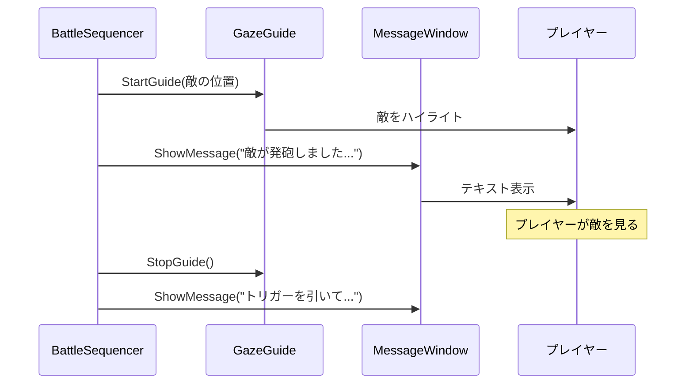
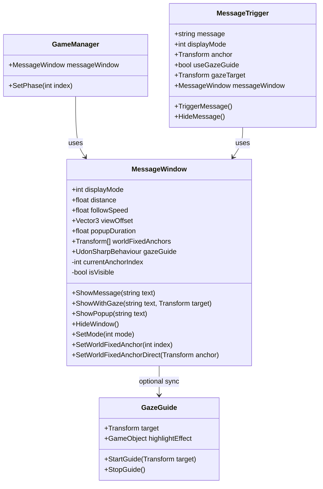

# システム設計書：VR可変式メッセージウィンドウシステム

> **実装状態**: ✅ 実装済  
> **ファイル**: [MessageWindow.cs](file:///e:/development/University/Syuron/Assets/Scripts/UI/MessageWindow.cs)  
> **関連**: [MessageTrigger.cs](file:///e:/development/University/Syuron/Assets/Scripts/UI/MessageTrigger.cs)

## 1. 概要

本システムは、VR空間内においてユーザー（学習者）に対し、シナリオの進行状況や学習コンテンツ（大村益次郎の解説、武器データ等）を提示するためのUIシステムである。

**MessageTrigger** コンポーネントと組み合わせることで、コードを変更せずにインスペクターからメッセージ内容を設定可能。

VR特有の**「酔い」**や**「没入感の阻害」**を防ぐため、視点追従の挙動を柔軟に切り替えられる設計とする。

---

## 2. 要件定義 (Requirements)

### 2.1. 動作モード (Display Modes)

フェーズごとの演出意図に合わせて、インスペクター上で以下の3つのモードを切り替え可能とする。

| モードID | モード名 | 挙動概要 | 使用想定フェーズ |
|----------|----------|----------|------------------|
| 0 | **常時表示 (Always On)** | 常に視界の下部に表示され、プレイヤーの移動・回転に遅延して追従する | Phase 2（作戦室）, Phase 3（戦闘中の解説） |
| 1 | **ポップアップ (Pop-up)** | 通常は非表示。イベント発生時のみ出現し、一定時間後または操作後に消滅する | 短い通知（敵撃破通知等） |
| 2 | **完全固定 (World Fixed)** | 視点に追従せず、ワールド内の特定座標（机の上、看板など）に固定される | Phase 1, 4（電脳空間での説明） |

> [!IMPORTANT]
> **Phase 3（戦闘フェーズ）の変更点**
> 当初はポップアップ (Mode 1) を想定していたが、SystemDesign.md の更新により、**テキスト解説を重視したガイド付き教育体験**に変更されたため、**常時表示 (Mode 0)** を主に使用する設計に変更。

### 2.2. フェーズ別UIモード対応表

| フェーズ | 主要UIモード | 補足 |
|---------|-------------|------|
| Phase 1: Intro | Mode 2 (World Fixed) | 看板形式で固定表示 |
| Phase 2: Strategy | Mode 0 (Always On) | 副官視点での解説 |
| Phase 3: Battle | **Mode 0 (Always On)** | ガイド付き教育体験 |
| Phase 4: Outro | Mode 2 (World Fixed) | まとめ表示 |

### 2.3. UX/UI要件

| 要件 | 説明 | 重要度 |
|------|------|--------|
| **遅延追従 (Lazy Follow)** | カメラの回転に対して即座に追従せず、少し遅れて滑らかに移動させることでVR酔いを軽減する | 必須 |
| **ビルボード処理** | 常にユーザーの方を向くように回転制御を行う | 必須 |
| **視認性の確保** | 背景パネル（半透明）とテキストを分離し、どのような背景でも文字が読めるようにする | 必須 |
| **フェードアニメーション** | 表示・非表示の切り替え時にフェードイン・アウトで滑らかに遷移する | 推奨 |
| **デスクトップ対応** | VRモードとデスクトップモードの両方で動作する | 必須 |
| **GazeGuide連携** | 注視誘導システムと同期してUIを表示する | 必須 |

---

## 3. GazeGuide連携設計

### 3.1. 概要

Phase 3 (Battle) では、**GazeGuide（注視誘導システム）**と**MessageWindow**が連携して動作する。
注視対象をハイライトすると同時に、その意味を解説するテキストを表示する。

### 3.2. 連携フロー



### 3.3. MessageWindow の追加プロパティ

| プロパティ | 型 | 説明 |
|-----------|------|------|
| `gazeGuide` | GazeGuide | 連携する注視誘導システムへの参照 |
| `syncWithGaze` | bool | GazeGuideと同期して表示/非表示を切り替えるか |

### 3.4. 追加メソッド

```csharp
/// <summary>
/// 注視誘導と同時にメッセージを表示する
/// </summary>
/// <param name="text">表示するメッセージ</param>
/// <param name="target">注視対象のTransform</param>
public void ShowWithGaze(string text, Transform target)
{
    if (gazeGuide != null)
    {
        gazeGuide.StartGuide(target);
    }
    ShowMessage(text);
}
```

---

## 4. クラス設計

### 4.1. クラス図



### 4.2. パブリックプロパティ

| プロパティ | 型 | 説明 | デフォルト値 |
|-----------|------|------|--------------| 
| `displayMode` | int | 動作モードの切り替え (0, 1, 2) | 0 |
| `distance` | float | カメラからウィンドウまでの距離 (m) | 1.5 |
| `followSpeed` | float | 追従のスムーズさ | 5.0 |
| `viewOffset` | Vector3 | 画面中央からの位置ズレ | (0, -0.3, 0) |
| `popupDuration` | float | ポップアップモード時の表示時間 (秒) | 5.0 |
| `worldFixedAnchors` | Transform[] | **フェーズごとのアンカー位置（配列）** | null |
| `gazeGuide` | UdonSharpBehaviour | 連携する注視誘導システム | null |
| `backgroundPanel` | GameObject | 背景パネルオブジェクト | - |
| `messageText` | TextMeshProUGUI | メッセージ表示用テキスト | - |

### 4.3. パブリックメソッド

```csharp
// 基本メソッド
public void ShowMessage(string text)
public void ShowPopup(string text)
public void HideWindow()
public void SetMode(int mode)

// GazeGuide連携
public void ShowWithGaze(string text, Transform target)

// アンカー切り替え (新規)
public void SetWorldFixedAnchor(int index)
public void SetWorldFixedAnchorDirect(Transform anchor)
```

---

## 5. 追従アルゴリズム

### 5.1. なぜ LateUpdate を使うのか

`Update` ではなく `LateUpdate` を使用する理由：

1. **ジッター防止**: カメラの移動処理が終わった後にUIの位置を計算することで、ガタつきを防ぐ
2. **追従の安定性**: プレイヤーの頭の位置が確定した後に計算するため、1フレーム遅れが発生しない

### 5.2. 目標座標の算出

```
Target = HeadPos + (HeadRot × Forward × Distance) + (HeadRot × Offset)
```

**変数説明:**
- `HeadPos`: プレイヤーの頭の位置
- `HeadRot`: プレイヤーの頭の回転
- `Forward`: 前方向ベクトル (`Vector3.forward`)
- `Distance`: UIまでの距離 (float)
- `Offset`: 画面内での位置オフセット (Vector3)

### 5.3. 線形補間 (Lerp) による滑らかな追従

```csharp
transform.position = Vector3.Lerp(
    transform.position,
    targetPosition,
    Time.deltaTime * followSpeed
);
```

**followSpeed の調整目安:**
| 値 | 挙動 |
|----|------|
| 1.0 ~ 3.0 | かなり遅延する（酔いにくいが操作感が重い） |
| **5.0** | **推奨値（バランスが良い）** |
| 10.0 ~ 15.0 | ほぼ即座に追従（素早いがやや酔いやすい） |

---

## 6. モード別処理詳細

### 6.1. Mode 0: 常時表示 (Always On)

```csharp
private void UpdatePositionAlwaysOn()
{
    VRCPlayerApi player = Networking.LocalPlayer;
    if (player == null) return;

    var headData = player.GetTrackingData(VRCPlayerApi.TrackingDataType.Head);
    Vector3 headPos = headData.position;
    Quaternion headRot = headData.rotation;

    Vector3 forward = headRot * Vector3.forward;
    Vector3 offset = headRot * viewOffset;
    Vector3 targetPos = headPos + forward * distance + offset;

    transform.position = Vector3.Lerp(transform.position, targetPos, Time.deltaTime * followSpeed);
    transform.LookAt(headPos);
    transform.Rotate(0, 180f, 0);
}
```

### 6.2. Mode 1: ポップアップ (Pop-up)

```csharp
private float popupTimer = 0f;

public void ShowPopup(string text)
{
    messageText.text = text;
    isVisible = true;
    popupTimer = popupDuration;
}

private void UpdatePopup()
{
    if (!isVisible) return;

    popupTimer -= Time.deltaTime;
    if (popupTimer <= 0f)
    {
        HideWindow();
    }
    else
    {
        UpdatePositionAlwaysOn();
    }
}
```

### 6.3. Mode 2: 完全固定 (World Fixed)

```csharp
private void UpdatePositionWorldFixed()
{
    if (worldFixedAnchors == null || worldFixedAnchors.Length == 0) return;
    if (currentAnchorIndex < 0 || currentAnchorIndex >= worldFixedAnchors.Length) return;
    
    Transform anchor = worldFixedAnchors[currentAnchorIndex];
    if (anchor == null) return;

    transform.position = anchor.position;
    transform.rotation = anchor.rotation;
}
```

---

## 7. MessageTrigger との連携

コードを変更せずにメッセージを設定する場合は、MessageTrigger コンポーネントを使用する。

詳細: [MessageTrigger.md](MessageTrigger.md)

---

## 7. Phase 3 戦闘シーケンス連携

### 7.1. BattleSequencer からの呼び出し例

```csharp
// BattleSequencer.cs
public class BattleSequencer : UdonSharpBehaviour
{
    public MessageWindow messageWindow;
    public GazeGuide gazeGuide;
    public Transform enemyTransform;
    public Transform gunTransform;

    // 3-A: 導入
    public void StartIntroduction()
    {
        messageWindow.SetMode(0); // Always On
        messageWindow.ShowWithGaze(
            "あなたは山道の物陰に潜んでいます。手元には最新式のミニエー銃があります。",
            gunTransform
        );
    }

    // 3-B: 敵の発砲
    public void StartEnemyFire()
    {
        messageWindow.ShowWithGaze(
            "敵が発砲しました。しかし火縄銃の射程は約50m。あなたまで届きません。",
            enemyTransform
        );
    }

    // 3-C: プレイヤーの発砲
    public void PromptPlayerFire()
    {
        messageWindow.ShowWithGaze(
            "トリガーを引いて敵を狙ってください。ミニエー銃の射程は約500m。この距離なら確実に届きます。",
            enemyTransform
        );
    }

    // 3-D: まとめ
    public void ShowConclusion()
    {
        gazeGuide.StopGuide();
        messageWindow.ShowMessage(
            "この射程差こそが、長州軍が少数でも幕府軍に勝てた理由の一つです。"
        );
    }
}
```

---

## 8. VR/デスクトップ両対応

### 8.1. モードの判定

```csharp
private bool IsVRMode()
{
    VRCPlayerApi player = Networking.LocalPlayer;
    if (player == null) return false;
    return player.IsUserInVR();
}
```

### 8.2. デスクトップモードでの調整

| 設定項目 | VRモード | デスクトップモード |
|----------|----------|-------------------|
| distance | 1.5m | 2.0m |
| followSpeed | 5.0 | 8.0 |
| viewOffset.y | -0.3 | -0.4 |

---

## 9. Hierarchyの構成

```
MessageWindow (Empty GameObject + MessageWindow.cs)
├── Canvas (World Space)
│   ├── BackgroundPanel (Image - 半透明黒)
│   │   └── MessageText (TextMeshPro)
│   └── CanvasGroup (for fade)
```

### 9.1. Canvas設定

| 設定項目 | 値 |
|----------|-----|
| Render Mode | World Space |
| Event Camera | None (VRChatが自動設定) |
| Sorting Order | 100+ (他のUIより手前) |
| Scale | (0.001, 0.001, 0.001) |

---

## 10. 使用例

### 10.1. GameManagerからの呼び出し

```csharp
public class GameManager : UdonSharpBehaviour
{
    public MessageWindow messageWindow;

    public void SetPhase(int nextIndex)
    {
        switch (nextIndex)
        {
            case 0: // Intro
                messageWindow.SetMode(2); // World Fixed
                break;
            case 1: // Strategy
                messageWindow.SetMode(0); // Always On
                break;
            case 2: // Battle
                messageWindow.SetMode(0); // Always On (変更: 以前はPop-up)
                break;
            case 3: // Outro
                messageWindow.SetMode(2); // World Fixed
                break;
        }
    }
}
```

---

## 11. テスト項目

### 11.1. 機能テスト

| # | テスト項目 | 期待結果 |
|---|-----------|----------|
| 1 | Mode 0 でUIが頭に追従するか | 頭を動かすとUIが遅延して追従する |
| 2 | Mode 1 でポップアップが一定時間後に消えるか | popupDuration 秒後に自動で消える |
| 3 | Mode 2 でUIがアンカーに固定されるか | 頭を動かしてもUIは固定位置に留まる |
| 4 | フェード処理が正常に動作するか | 表示・非表示時に滑らかにフェードする |
| 5 | ShowWithGaze で GazeGuide が起動するか | 対象のハイライトとテキストが同時に表示される |

### 11.2. VR酔い確認

| # | テスト項目 | 期待結果 |
|---|-----------|----------|
| 1 | 急激な頭の動きでUIがガタつかないか | 滑らかに追従する |
| 2 | followSpeed=5.0 で酔いを感じないか | 5分間の使用で酔わない |
| 3 | デスクトップモードで違和感がないか | 自然に見える |

---

## 12. 実装スケジュール

| 週 | タスク |
|----|--------|
| Week 1 | 基本構造の実装 (Mode 0のみ) |
| Week 2 | Mode 1, 2 の実装 |
| Week 3 | GazeGuide連携・フェード処理の実装 |
| Week 4 | テスト・調整 |

---

## 更新履歴

| 日付 | 内容 |
|------|------|
| 2026-01-18 | 初版作成 |
| 2026-01-18 | Phase 3 の UIモードを Mode 0 に変更、GazeGuide連携を追加 |
| 2026-01-25 | 実装完了、worldFixedAnchors配列化、MessageTrigger連携追加 |