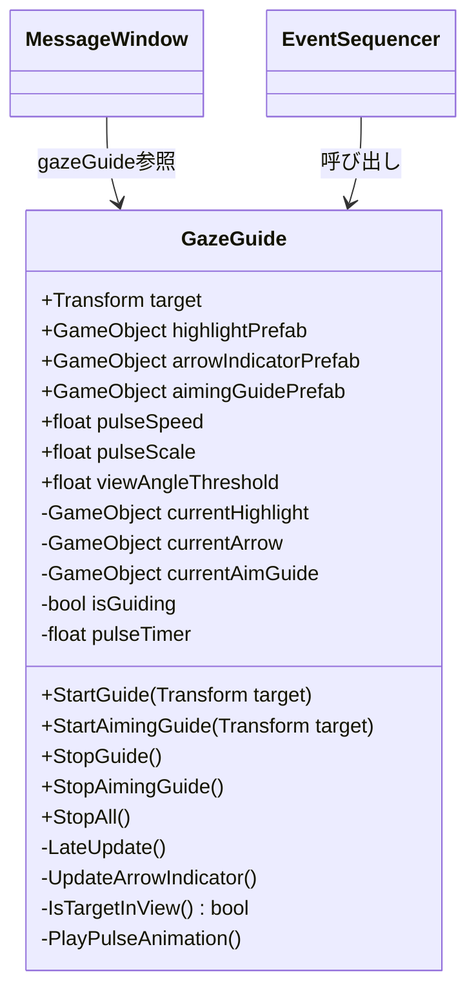

# GazeGuide（注視誘導システム）設計書

> **実装状態**: 📝 設計中  
> **ファイル**: `Assets/Scripts/UI/GazeGuide.cs`

---

## 1. 概要

### 1.1. 目的
プレイヤーが**見るべきもの**を明確に示し、教育的に重要な瞬間を見逃させない。

VR空間では視野が広く自由に動き回れるため、重要なイベントを見逃しやすい。GazeGuideは視覚的なエフェクトで注目すべきオブジェクトへプレイヤーの視線を誘導する。

### 1.2. ユースケース

| フェーズ | シーン | 誘導対象 | 目的 |
|---------|--------|----------|------|
| Phase 3-A | 導入 | プレイヤーの銃 | 武器の存在を認識させる |
| Phase 3-B | 敵発砲 | 敵兵 | 敵の発砲を確実に見せる |
| Phase 3-C | 発砲促進 | 敵兵 | 照準を合わせる位置を示す |

---

## 2. 誘導手法

| 手法 | 説明 | 使用シーン |
|------|------|-----------| 
| **ハイライト** | 対象オブジェクトの輪郭を光らせる | 銃、敵兵の強調 |
| **矢印インジケータ** | 視界外の対象への方向を示す | 敵が視界外にいる時 |
| **照準ガイド** | 敵の位置に照準マーカーを表示 | 発砲を促す時 |
| **パルスアニメ** | 対象を拡大縮小で目立たせる | 注目すべき瞬間 |

---

## 3. クラス設計

### 3.1. クラス図



### 3.2. パブリックプロパティ

| プロパティ | 型 | 説明 | デフォルト値 |
|-----------|------|------|--------------| 
| `target` | Transform | 現在の注視対象 | null |
| `highlightPrefab` | GameObject | ハイライトエフェクトのプレハブ | - |
| `arrowIndicatorPrefab` | GameObject | 矢印UIのプレハブ | - |
| `aimingGuidePrefab` | GameObject | 照準ガイドのプレハブ | - |
| `pulseSpeed` | float | パルスアニメーションの速度 | 2.0 |
| `pulseScale` | float | パルスの最大拡大率 | 1.2 |
| `viewAngleThreshold` | float | 視界内判定の角度閾値（度） | 60.0 |

---

## 4. API仕様

### 4.1. StartGuide

```csharp
/// <summary>
/// 指定したオブジェクトへの注視誘導を開始する
/// ハイライト表示 + 視界外なら矢印表示
/// </summary>
/// <param name="newTarget">注視対象のTransform</param>
public void StartGuide(Transform newTarget)
```

**動作**:
1. 対象にハイライトエフェクトをアタッチ
2. パルスアニメーション開始
3. 視界外なら矢印インジケータを表示

**使用例**:
```csharp
// EventSequencer から呼び出し
gazeGuide.StartGuide(gunTransform);
```

---

### 4.2. StartAimingGuide

```csharp
/// <summary>
/// 照準ガイドを表示する（発砲を促す時用）
/// </summary>
/// <param name="newTarget">照準対象のTransform</param>
public void StartAimingGuide(Transform newTarget)
```

**動作**:
1. 対象の位置に照準マーカーを表示
2. 収縮アニメーションで注目を集める

**使用例**:
```csharp
// プレイヤーに発砲を促す時
gazeGuide.StartAimingGuide(enemyTransform);
```

---

### 4.3. StopGuide

```csharp
/// <summary>
/// 注視誘導（ハイライト・矢印）を停止する
/// </summary>
public void StopGuide()
```

**動作**:
1. ハイライトエフェクトを非表示
2. 矢印インジケータを非表示
3. パルスアニメーション停止

---

### 4.4. StopAimingGuide

```csharp
/// <summary>
/// 照準ガイドのみ停止する
/// </summary>
public void StopAimingGuide()
```

---

### 4.5. StopAll

```csharp
/// <summary>
/// すべての誘導エフェクトを停止する
/// </summary>
public void StopAll()
```

---

## 5. 実装詳細

### 5.1. ハイライト表示

```csharp
public void StartGuide(Transform newTarget)
{
    target = newTarget;
    isGuiding = true;

    // ハイライトエフェクトを生成
    if (highlightPrefab != null && currentHighlight == null)
    {
        currentHighlight = VRCInstantiate(highlightPrefab);
        currentHighlight.transform.SetParent(target);
        currentHighlight.transform.localPosition = Vector3.zero;
        currentHighlight.transform.localScale = Vector3.one;
    }

    if (currentHighlight != null)
    {
        currentHighlight.SetActive(true);
    }
}
```

### 5.2. 視界外判定

```csharp
private bool IsTargetInView()
{
    VRCPlayerApi player = Networking.LocalPlayer;
    if (player == null || target == null) return false;

    var headData = player.GetTrackingData(VRCPlayerApi.TrackingDataType.Head);
    Vector3 headPos = headData.position;
    Vector3 headForward = headData.rotation * Vector3.forward;

    Vector3 toTarget = (target.position - headPos).normalized;
    float angle = Vector3.Angle(headForward, toTarget);

    return angle <= viewAngleThreshold;
}
```

### 5.3. 矢印インジケータ更新

```csharp
private void UpdateArrowIndicator()
{
    if (target == null) return;

    bool inView = IsTargetInView();

    // 視界外なら矢印を表示
    if (!inView)
    {
        if (currentArrow == null && arrowIndicatorPrefab != null)
        {
            currentArrow = VRCInstantiate(arrowIndicatorPrefab);
        }

        if (currentArrow != null)
        {
            currentArrow.SetActive(true);
            PositionArrowIndicator();
        }
    }
    else
    {
        // 視界内なら矢印を非表示
        if (currentArrow != null)
        {
            currentArrow.SetActive(false);
        }
    }
}

private void PositionArrowIndicator()
{
    VRCPlayerApi player = Networking.LocalPlayer;
    if (player == null || currentArrow == null) return;

    var headData = player.GetTrackingData(VRCPlayerApi.TrackingDataType.Head);

    // 対象への方向を計算
    Vector3 toTarget = target.position - headData.position;
    
    // 視線からの水平方向成分を取得
    Vector3 forward = headData.rotation * Vector3.forward;
    Vector3 projected = Vector3.ProjectOnPlane(toTarget, forward).normalized;

    // 矢印を視界の端に配置
    float edgeDistance = 0.5f;
    Vector3 arrowPos = headData.position 
        + forward * 1.2f 
        + projected * edgeDistance;

    currentArrow.transform.position = arrowPos;

    // 矢印を対象方向に向ける
    currentArrow.transform.rotation = Quaternion.LookRotation(projected, forward);
}
```

### 5.4. パルスアニメーション

```csharp
private void PlayPulseAnimation()
{
    if (currentHighlight == null) return;

    pulseTimer += Time.deltaTime * pulseSpeed;
    float scale = 1f + (Mathf.Sin(pulseTimer) * 0.5f + 0.5f) * (pulseScale - 1f);
    currentHighlight.transform.localScale = Vector3.one * scale;
}
```

### 5.5. LateUpdate

```csharp
void LateUpdate()
{
    if (!isGuiding || target == null) return;

    // 矢印インジケータの更新
    UpdateArrowIndicator();

    // パルスアニメーション
    PlayPulseAnimation();
}
```

---

## 6. エフェクト仕様

### 6.1. ハイライトエフェクト

| 項目 | 仕様 |
|------|------|
| **見た目** | オブジェクトの輪郭を光らせる（発光パーティクル or アウトラインシェーダー） |
| **色** | 黄色〜オレンジ系（#FFD54F 〜 #FF9800） |
| **アニメーション** | ゆっくりパルス（1.0〜1.2倍スケール変化、2秒周期） |
| **レイヤー** | UI / Overlay（常に前面表示） |

### 6.2. 矢印インジケータ

| 項目 | 仕様 |
|------|------|
| **見た目** | シンプルな三角形の矢印（2Dスプライト） |
| **配置** | 視界の端、対象の方向を示す |
| **色** | 白〜黄色（アウトライン付き、背景を問わず視認可能） |
| **アニメーション** | 対象方向へバウンス（上下動）アニメーション |

### 6.3. 照準ガイド

| 項目 | 仕様 |
|------|------|
| **見た目** | 円形の照準マーカー（リング + 十字線） |
| **配置** | 対象（敵兵）のワールド座標に固定 |
| **色** | 赤〜オレンジ（#F44336 〜 #FF5722） |
| **アニメーション** | 収縮アニメーション（照準が絞られる演出） |

---

## 7. Hierarchy構成

```
World
├── GazeGuide (GazeGuide.cs)
│   ├── [参照] HighlightPrefab
│   ├── [参照] ArrowIndicatorPrefab
│   └── [参照] AimingGuidePrefab
└── ...

Prefabs/
├── Effects/
│   ├── GazeHighlight.prefab      # ハイライトエフェクト
│   ├── GazeArrowIndicator.prefab # 矢印インジケータ
│   └── GazeAimingGuide.prefab    # 照準ガイド
```

---

## 8. 連携仕様

### 8.1. MessageWindow との連携

`MessageWindow.ShowWithGaze()` から呼び出される。

```csharp
// MessageWindow.cs 側
public void ShowWithGaze(string text, Transform target)
{
    if (gazeGuide != null && target != null)
    {
        gazeGuide.SetProgramVariable("target", target);
        gazeGuide.SendCustomEvent("StartGuide");
    }
    ShowMessage(text);
}
```

### 8.2. EventSequencer との連携

各サブフェーズで直接呼び出される。

```csharp
// EventSequencer.cs 側
private void RunSubPhase_3A()
{
    gazeGuide.StartGuide(gunTransform);
    messageWindow.ShowMessage("あなたは山道の物陰に潜んでいます...");
}

private void RunSubPhase_3C()
{
    gazeGuide.StartAimingGuide(enemyTransform);
    messageWindow.ShowMessage("トリガーを引いて敵を狙ってください...");
}
```

---

## 9. 制約事項

### 9.1. UdonSharp 制限

| 制限 | 対応 |
|------|------|
| `Instantiate()` 使用不可 | `VRCInstantiate()` を使用 |
| `Destroy()` 使用不可 | `SetActive(false)` で非表示化 |
| ジェネリクス使用不可 | 配列で代替 |

### 9.2. パフォーマンス考慮

- ハイライトエフェクトは1つのみ（複数対象の同時誘導は非対応）
- `LateUpdate()` 内の処理は最小限に
- 非アクティブ時は `isGuiding = false` で処理スキップ

---

## 10. テスト項目

| # | テスト項目 | 期待結果 |
|---|-----------|----------|
| 1 | `StartGuide()` で対象がハイライトされるか | 対象の周囲に光のエフェクト |
| 2 | 視界外で矢印が表示されるか | 画面端に方向を示す矢印 |
| 3 | 視界内に入ると矢印が消えるか | ハイライトのみ残る |
| 4 | パルスアニメーションが動作するか | スケールが周期的に変化 |
| 5 | `StartAimingGuide()` で照準が表示されるか | 敵の位置にマーカー |
| 6 | `StopGuide()` でエフェクトが消えるか | クリーンアップ完了 |
| 7 | VR/デスクトップ両方で動作するか | プラットフォーム非依存 |

---

## 11. 実装スケジュール

| ステップ | 内容 | 見積もり |
|----------|------|----------|
| 1 | 基本クラス実装（プロパティ・スタブ） | 30分 |
| 2 | ハイライト機能実装 | 1時間 |
| 3 | 矢印インジケータ実装 | 1時間 |
| 4 | 照準ガイド実装 | 30分 |
| 5 | エフェクト Prefab 作成 | 1時間 |
| 6 | 連携テスト | 30分 |

---

## 更新履歴

| 日付 | 内容 |
|------|------|
| 2026-01-25 | 初版作成 |
