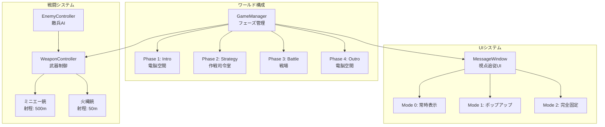
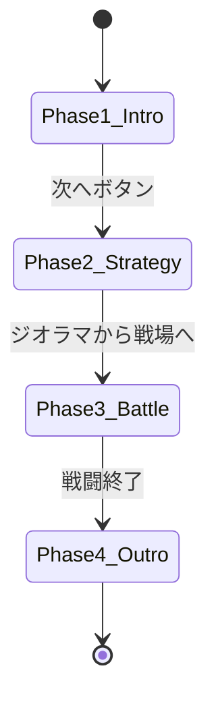
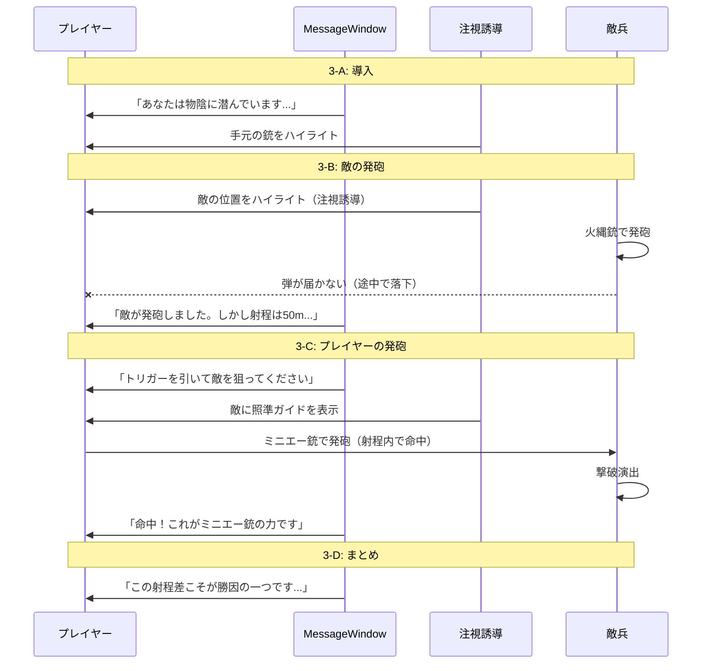

# VRChat教育ワールド システム設計書

## 1. プロジェクト概要

### 1.1. コンセプト
**「なぜ少数の長州軍が大軍に勝てたのか？を「武器」と「戦術」の視点から学ぶ。」**

VRChat上で動作する教育用VRコンテンツ。第二次長州征討の「石州口の戦い」を題材に、VR空間体験とビジュアルノベル要素を組み合わせ、歴史的事象の因果関係を直感的に理解させることを目的とする。

### 1.2. 教育目標
| 目標 | 達成方法 |
|------|---------|
| 射程距離の差の理解 | ミニエー銃 vs 火縄銃の実射体験 |
| 地形の有利不利の理解 | ジオラマ俯瞰視点 + 1:1スケール戦場体験 |
| 戦術の重要性の理解 | 大村益次郎による解説 (VN形式) |

### 1.3. プレイヤーの役割
- 大村益次郎の**副官** (作戦室フェーズ)
- **長州藩の兵士** (戦場フェーズ)

---

## 2. アーキテクチャ概要



---

## 3. フェーズ設計

### 3.1. フェーズ一覧

| フェーズ | 名称 | 場所 | 目的 |
|---------|------|------|------|
| Phase 1 | Intro | 電脳空間 | 背景説明・導入 |
| Phase 2 | Strategy | 作戦司令室 | ジオラマで俯瞰視点を得る、戦術解説 |
| Phase 3 | Battle | 戦場 | 1:1スケールでの戦闘体験 |
| Phase 4 | Outro | 電脳空間 | まとめ・学習の発展促進 |

### 3.2. フェーズ遷移図



### 3.3. Phase 1: Intro (電脳空間)

#### 目的
- 第二次長州征討の歴史的背景の説明
- プレイヤーの役割の説明
- 操作説明

#### 演出
- 環境：抽象的なグリッド空間（電脳空間）
- UI：ワールド固定モード（Mode 2）で看板形式
- ナレーション：テキスト + 音声（将来実装）

#### 必要なシステム
- MessageWindow (Mode 2: World Fixed)
- NextButton

---

### 3.4. Phase 2: Strategy (作戦司令室)

#### 目的
- 戦場の地形を俯瞰で把握
- 大村益次郎による戦術解説
- 武器性能の数値的理解

#### 演出
- 環境：和風の作戦室
- 中央にジオラマ（戦場の縮小模型）
- 大村益次郎のアバターが解説

#### サブフェーズ
1. **2-A: 地形説明** - ジオラマで敵味方の配置を解説
2. **2-B: 武器解説** - ミニエー銃と火縄銃の比較
3. **2-C: 戦術解説** - なぜ待ち伏せが有効なのか

#### 必要なシステム
- MessageWindow (Mode 0: Always On)
- DialoagueSystem (VN形式)
- CharacterController (大村益次郎)
- JioramaInteraction (ジオラマハイライト)

---

### 3.5. Phase 3: Battle (戦場)

#### 目的
- 射程の差を**体感**する
- テキスト解説で射程差の**理論的理解**を促す
- 注視誘導で重要な瞬間を**見逃させない**

#### 設計コンセプト
戦闘フェーズは「自由なゲームプレイ」ではなく、**ガイド付きの教育体験**として設計する。
プレイヤーの行動を制限し、重要なシーンでは**注視誘導**と**テキスト解説**で学習ポイントを確実に伝える。

#### 演出
- 環境：山道（ジオラマと同じ地形の1:1スケール）
- プレイヤーは隠れた位置からミニエー銃で敵を狙う
- 敵は火縄銃で反撃するが弾が届かない

---

#### サブフェーズ詳細

##### 3-A: 導入・配置説明
| 項目 | 内容 |
|------|------|
| 状態 | プレイヤーは物陰に隠れている |
| UI | MessageWindow (Mode 0: 常時表示) |
| 解説テキスト | 「あなたは山道の物陰に潜んでいます。手元には最新式のミニエー銃があります。」 |
| 注視誘導 | プレイヤーの手元の銃をハイライト |

##### 3-B: 敵兵の発砲シーン
| 項目 | 内容 |
|------|------|
| イベント | 敵兵が火縄銃で発砲する |
| 注視誘導 | **敵兵の位置をハイライト** → 視線を敵に向けさせる |
| 演出 | 発砲音・発砲エフェクト → 弾がプレイヤーの手前で落下する |
| 解説テキスト | 「敵が発砲しました。しかし火縄銃の射程は約50m。あなたまで届きません。」 |
| 教育ポイント | 火縄銃の射程限界を**視覚的に体験**させる |

```
[敵兵] ───(発砲)───> ❌ 弾が途中で落下
        ├─────────────┤
            50m (火縄銃の射程)
        ├─────────────────────────────────┤
                  200m (プレイヤーとの距離)
```

##### 3-C: プレイヤーの発砲シーン
| 項目 | 内容 |
|------|------|
| UI | MessageWindow (Mode 0: 常時表示) |
| 解説テキスト | 「トリガーを引いて敵を狙ってください。ミニエー銃の射程は約500m。この距離なら確実に届きます。」 |
| プレイヤー操作 | **発砲を促すUI表示** → トリガー入力を待機 |
| 注視誘導 | 敵兵の位置に**照準ガイド**を表示 |
| 演出 | 発砲 → 弾道表示（オプション） → 命中エフェクト |
| 結果テキスト | 「命中！500m離れた敵を倒すことができました。これがミニエー銃の力です。」 |

```
[プレイヤー] ───(発砲)──────────────────────> ✅ 敵に命中
             ├─────────────────────────────────┤
                       200m (敵との距離)
             ├─────────────────────────────────────────────────────┤
                               500m (ミニエー銃の射程)
```

##### 3-D: まとめ解説
| 項目 | 内容 |
|------|------|
| 状態 | 戦闘終了、プレイヤーは動けない |
| UI | MessageWindow (Mode 0: 常時表示) |
| 解説テキスト | 「この射程差こそが、長州軍が少数でも幕府軍に勝てた理由の一つです。敵は一方的に撃たれ、反撃すらできなかったのです。」 |
| 次へ | NextButton で Phase 4 へ |

---

#### ゲームフロー図



---

#### 注視誘導システム (GazeGuide)

プレイヤーの視線を重要なオブジェクトに誘導するためのシステム。

| 機能 | 説明 |
|------|------|
| **ハイライト表示** | 対象オブジェクトの周囲に光る輪郭線を表示 |
| **矢印ガイド** | 視界外にある場合、画面端に方向を示す矢印を表示 |
| **パルスアニメーション** | 注目させたい瞬間に対象を拡大・縮小アニメーション |
| **照準ガイド** | 発砲時に敵の位置に照準マーカーを表示 |

```csharp
// GazeGuide.cs (概念設計)
public class GazeGuide : UdonSharpBehaviour
{
    public Transform target;           // 注視対象
    public GameObject highlightEffect; // ハイライトエフェクト
    public GameObject arrowIndicator;  // 矢印インジケータ

    public void StartGuide(Transform newTarget)
    {
        target = newTarget;
        highlightEffect.SetActive(true);
        // プレイヤーの視界外なら矢印を表示
    }

    public void StopGuide()
    {
        highlightEffect.SetActive(false);
        arrowIndicator.SetActive(false);
    }
}
```

---

#### 必要なシステム

| システム | 状態 | 説明 |
|---------|------|------|
| WeaponController | ✅ 実装済 | 武器の発砲・命中判定 |
| EnemyController | ❌ 未実装 | 敵兵のAI・被弾処理 |
| **GazeGuide** | ❌ 未実装 | **注視誘導システム（新規追加）** |
| **BattleSequencer** | ❌ 未実装 | **戦闘シーケンス制御（新規追加）** |
| MessageWindow | 🔧 設計中 | 視点追従UI |
| HitEffect | ❌ 未実装 | 命中エフェクト |
| MuzzleFlash | ❌ 未実装 | 発砲エフェクト |

---

### 3.6. Phase 4: Outro (電脳空間)

#### 目的
- 学習内容の振り返り
- 発展学習への誘導

#### 演出
- Phase 1と同じ電脳空間
- 体験した内容のサマリー表示
- 「もっと調べてみよう」メッセージ

---

## 4. システムコンポーネント

### 4.1. コンポーネント一覧

| カテゴリ | スクリプト名 | 状態 | 説明 |
|---------|-------------|------|------|
| **コア** | GameManager | ✅ 実装済 | フェーズ管理・遷移制御 |
| **コア** | NextButton | ✅ 実装済 | フェーズ遷移トリガー |
| **コア** | BattleSequencer | 📝 設計済 | 戦闘シーケンス制御 |
| **UI** | MessageWindow | 📝 設計済 | 視点追従UIシステム |
| **UI** | GazeGuide | 📝 設計済 | 注視誘導システム |
| **UI** | DialogueSystem | ❌ 未実装 | VN形式の会話システム |
| **戦闘** | WeaponController | ✅ 実装済 | 武器の発砲・リロード |
| **戦闘** | EnemyController | ❌ 未実装 | 敵兵のAI・被弾処理 |
| **エフェクト** | MuzzleFlash | ❌ 未実装 | 発砲エフェクト |
| **エフェクト** | HitEffect | ❌ 未実装 | 命中エフェクト |

### 4.2. GameManager (実装済み)

**役割**: フェーズ管理とプレイヤーのテレポート

```csharp
// 主要プロパティ
public GameObject[] phaseRoots;    // 各フェーズの親オブジェクト
public Transform[] spawnPoints;    // 各フェーズの開始位置

// 主要メソッド
public void GoToNextPhase();       // 次のフェーズへ進む
public void SetPhase(int index);   // 指定フェーズへ遷移
```

### 4.3. WeaponController (実装済み)

**役割**: 武器の発砲・命中判定・リロード管理

```csharp
// 主要プロパティ
public float maxRange = 50f;       // 射程距離(m)
public float reloadTime = 3.0f;    // リロード時間(秒)

// 武器の設定例
// ミニエー銃: maxRange = 500f, reloadTime = 15f
// 火縄銃:     maxRange = 50f,  reloadTime = 30f
```

---

## 5. ディレクトリ構成

```
Assets/
├── Scripts/
│   ├── MainSystem/
│   │   ├── GameManager.cs       ✅
│   │   └── NextButton.cs        ✅
│   ├── UI/
│   │   ├── MessageWindow.cs     🔧
│   │   └── DialogueSystem.cs    ❌
│   ├── Gun/
│   │   └── WeaponController.cs  ✅
│   └── Enemy/
│       ├── EnemyController.cs   ❌
│       └── EnemySpawner.cs      ❌
├── Prefabs/
│   ├── UI/
│   │   └── MessageWindow.prefab
│   ├── Weapons/
│   │   ├── MinieRifle.prefab    (ミニエー銃)
│   │   └── Matchlock.prefab     (火縄銃)
│   └── Characters/
│       ├── OmuraMasujiro.prefab (大村益次郎)
│       └── Enemy.prefab         (敵兵)
├── Scenes/
│   ├── Phase1_Intro/
│   ├── Phase2_Strategy/
│   ├── Phase3_Battle/
│   └── Phase4_Outro/
└── Materials/
    └── ...
```

---

## 6. 実装優先順位

### Phase 1: システムプロトタイプ (1月)
1. [x] GameManager - フェーズ管理
2. [x] NextButton - 遷移トリガー
3. [x] WeaponController - 武器システム
4. [ ] **MessageWindow - 視点追従UI** ← 現在ここ
5. [ ] EnemyController - 敵兵AI

### Phase 2: コンテンツ導入 (2月)
6. [ ] DialogueSystem - 会話システム
7. [ ] ジオラマシーンの構築
8. [ ] 大村益次郎のアバター導入

### Phase 3: 完成度向上 (3-4月)
9. [ ] エフェクト追加
10. [ ] サウンド追加
11. [ ] ユーザーテスト・調整

---

## 7. 技術スタック

| カテゴリ | 技術 |
|---------|------|
| ゲームエンジン | Unity 2022.x |
| VRプラットフォーム | VRChat SDK3 (Worlds) |
| スクリプト言語 | UdonSharp (C#ベース) |
| 3Dモデリング | Houdini / Blender |
| エフェクト | Particle System |

---

## 更新履歴

| 日付 | 内容 |
|------|------|
| 2026-01-18 | 初版作成 |
