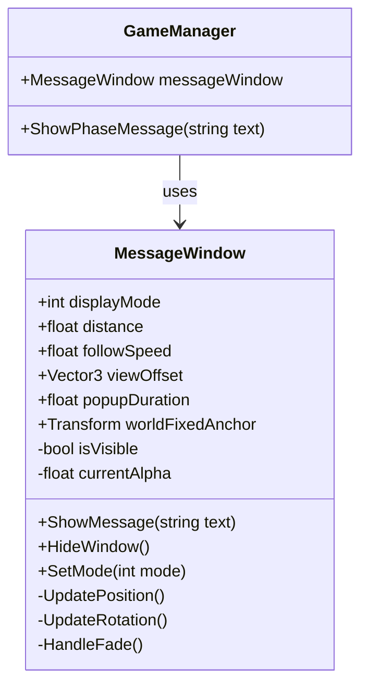

# システム設計書：VR可変式メッセージウィンドウシステム

## 1. 概要

本システムは、VR空間内においてユーザー（学習者）に対し、シナリオの進行状況や学習コンテンツ（大村益次郎の解説、武器データ等）を提示するためのUIシステムである。

VR特有の**「酔い」**や**「没入感の阻害」**を防ぐため、視点追従の挙動を柔軟に切り替えられる設計とする。

---

## 2. 要件定義 (Requirements)

### 2.1. 動作モード (Display Modes)

フェーズごとの演出意図に合わせて、インスペクター上で以下の3つのモードを切り替え可能とする。

| モードID | モード名 | 挙動概要 | 使用想定フェーズ |
|----------|----------|----------|------------------|
| 0 | **常時表示 (Always On)** | 常に視界の下部に表示され、プレイヤーの移動・回転に遅延して追従する | Phase 2前半（副官視点での解説） |
| 1 | **ポップアップ (Pop-up)** | 通常は非表示。イベント発生時のみ出現し、一定時間後または操作後に消滅する | Phase 3（戦闘中、重要な通知のみ） |
| 2 | **完全固定 (World Fixed)** | 視点に追従せず、ワールド内の特定座標（机の上、看板など）に固定される | Phase 1（電脳空間での説明） |

### 2.2. UX/UI要件

| 要件 | 説明 | 重要度 |
|------|------|--------|
| **遅延追従 (Lazy Follow)** | カメラの回転に対して即座に追従せず、少し遅れて滑らかに移動させることでVR酔いを軽減する | 必須 |
| **ビルボード処理** | 常にユーザーの方を向くように回転制御を行う | 必須 |
| **視認性の確保** | 背景パネル（半透明）とテキストを分離し、どのような背景でも文字が読めるようにする | 必須 |
| **フェードアニメーション** | 表示・非表示の切り替え時にフェードイン・アウトで滑らかに遷移する | 推奨 |
| **デスクトップ対応** | VRモードとデスクトップモードの両方で動作する | 必須 |

---

## 3. 実装詳細 (Implementation)

### 3.1. クラス設計

単一のUdonSharpスクリプト `MessageWindow` で制御する。



### 3.2. パブリックプロパティ

| プロパティ | 型 | 説明 | デフォルト値 |
|-----------|------|------|--------------|
| `displayMode` | int | 動作モードの切り替え (0, 1, 2) | 0 |
| `distance` | float | カメラからウィンドウまでの距離 (m) | 1.5 |
| `followSpeed` | float | 追従のスムーズさ | 5.0 |
| `viewOffset` | Vector3 | 画面中央からの位置ズレ | (0, -0.3, 0) |
| `popupDuration` | float | ポップアップモード時の表示時間 (秒) | 5.0 |
| `worldFixedAnchor` | Transform | 完全固定モード時のアンカー位置 | null |
| `backgroundPanel` | GameObject | 背景パネルオブジェクト | - |
| `messageText` | TextMeshProUGUI | メッセージ表示用テキスト | - |

### 3.3. パブリックメソッド

```csharp
/// <summary>
/// テキストを更新してウィンドウを表示する
/// </summary>
/// <param name="text">表示するメッセージ</param>
public void ShowMessage(string text)

/// <summary>
/// ウィンドウを非表示にする
/// </summary>
public void HideWindow()

/// <summary>
/// 動作モードを切り替える
/// </summary>
/// <param name="mode">0: Always On, 1: Pop-up, 2: World Fixed</param>
public void SetMode(int mode)
```

---

## 4. 追従アルゴリズム

### 4.1. なぜ LateUpdate を使うのか

`Update` ではなく `LateUpdate` を使用する理由：

1. **ジッター防止**: カメラの移動処理が終わった後にUIの位置を計算することで、ガタつきを防ぐ
2. **追従の安定性**: プレイヤーの頭の位置が確定した後に計算するため、1フレーム遅れが発生しない

### 4.2. 目標座標の算出

```
Target = HeadPos + (HeadRot × Forward × Distance) + (HeadRot × Offset)
```

**変数説明:**
- `HeadPos`: プレイヤーの頭の位置 (`Networking.LocalPlayer.GetTrackingData(TrackingDataType.Head).position`)
- `HeadRot`: プレイヤーの頭の回転 (`Networking.LocalPlayer.GetTrackingData(TrackingDataType.Head).rotation`)
- `Forward`: 前方向ベクトル (`Vector3.forward`)
- `Distance`: UIまでの距離 (float)
- `Offset`: 画面内での位置オフセット (Vector3)

### 4.3. 線形補間 (Lerp) による滑らかな追従

```csharp
// 現在位置から目標座標へ、followSpeed の割合で近づける
transform.position = Vector3.Lerp(
    transform.position,
    targetPosition,
    Time.deltaTime * followSpeed
);
```

**followSpeed の調整目安:**
| 値 | 挙動 |
|----|------|
| 1.0 ~ 3.0 | かなり遅延する（酔いにくいが操作感が重い） |
| **5.0** | **推奨値（バランスが良い）** |
| 10.0 ~ 15.0 | ほぼ即座に追従（素早いがやや酔いやすい） |

### 4.4. 回転制御

```csharp
// プレイヤーの方を向かせる
transform.LookAt(headPosition);

// UIの裏表を補正（LookAtするとUIが裏返しになるため）
transform.Rotate(0, 180f, 0);
```

---

## 5. モード別処理詳細

### 5.1. Mode 0: 常時表示 (Always On)

```csharp
private void UpdatePositionAlwaysOn()
{
    VRCPlayerApi player = Networking.LocalPlayer;
    if (player == null) return;

    // 頭のトラッキングデータを取得
    var headData = player.GetTrackingData(VRCPlayerApi.TrackingDataType.Head);
    Vector3 headPos = headData.position;
    Quaternion headRot = headData.rotation;

    // 目標位置を計算
    Vector3 forward = headRot * Vector3.forward;
    Vector3 offset = headRot * viewOffset;
    Vector3 targetPos = headPos + forward * distance + offset;

    // 滑らかに追従
    transform.position = Vector3.Lerp(transform.position, targetPos, Time.deltaTime * followSpeed);

    // プレイヤーの方を向く
    transform.LookAt(headPos);
    transform.Rotate(0, 180f, 0);
}
```

### 5.2. Mode 1: ポップアップ (Pop-up)

```csharp
private float popupTimer = 0f;

public void ShowPopup(string text)
{
    messageText.text = text;
    isVisible = true;
    popupTimer = popupDuration;
}

private void UpdatePopup()
{
    if (!isVisible) return;

    popupTimer -= Time.deltaTime;
    if (popupTimer <= 0f)
    {
        HideWindow();
    }
    else
    {
        // 表示中は常時表示と同じ追従
        UpdatePositionAlwaysOn();
    }
}
```

### 5.3. Mode 2: 完全固定 (World Fixed)

```csharp
private void UpdatePositionWorldFixed()
{
    if (worldFixedAnchor == null) return;

    // アンカー位置に固定
    transform.position = worldFixedAnchor.position;
    transform.rotation = worldFixedAnchor.rotation;
}
```

---

## 6. フェード処理

### 6.1. フェードの実装

```csharp
[SerializeField] private float fadeDuration = 0.3f;
private float targetAlpha = 0f;

private void HandleFade()
{
    float current = canvasGroup.alpha;
    float target = isVisible ? 1f : 0f;

    canvasGroup.alpha = Mathf.MoveTowards(current, target, Time.deltaTime / fadeDuration);

    // 完全に透明になったら非アクティブ化（パフォーマンス）
    if (canvasGroup.alpha == 0f && !isVisible)
    {
        gameObject.SetActive(false);
    }
}
```

---

## 7. VR/デスクトップ両対応

### 7.1. モードの判定

```csharp
private bool IsVRMode()
{
    VRCPlayerApi player = Networking.LocalPlayer;
    if (player == null) return false;
    return player.IsUserInVR();
}
```

### 7.2. デスクトップモードでの調整

| 設定項目 | VRモード | デスクトップモード |
|----------|----------|-------------------|
| distance | 1.5m | 2.0m |
| followSpeed | 5.0 | 8.0 |
| viewOffset.y | -0.3 | -0.4 |

```csharp
void Start()
{
    if (!IsVRMode())
    {
        distance = 2.0f;
        followSpeed = 8.0f;
        viewOffset = new Vector3(0, -0.4f, 0);
    }
}
```

---

## 8. Hierarchyの構成

```
MessageWindow (Empty GameObject + MessageWindow.cs)
├── Canvas (World Space)
│   ├── BackgroundPanel (Image - 半透明黒)
│   │   └── MessageText (TextMeshPro)
│   └── CanvasGroup (for fade)
```

### 8.1. Canvas設定

| 設定項目 | 値 |
|----------|-----|
| Render Mode | World Space |
| Event Camera | None (VRChatが自動設定) |
| Sorting Order | 100+ (他のUIより手前) |
| Scale | (0.001, 0.001, 0.001) |

### 8.2. BackgroundPanel設定

| 設定項目 | 値 |
|----------|-----|
| Width/Height | 800 x 200 |
| Color | (0, 0, 0, 0.7) |
| Corner Radius | 20px |

---

## 9. 使用例

### 9.1. GameManagerからの呼び出し

```csharp
// GameManager.cs
public class GameManager : UdonSharpBehaviour
{
    public MessageWindow messageWindow;

    public void SetPhase(int nextIndex)
    {
        // ... 既存のフェーズ遷移処理 ...

        // フェーズに応じたUIモードを設定
        switch (nextIndex)
        {
            case 0: // Intro
                messageWindow.SetMode(2); // World Fixed
                break;
            case 1: // Strategy
                messageWindow.SetMode(0); // Always On
                break;
            case 2: // Battle
                messageWindow.SetMode(1); // Pop-up
                break;
            case 3: // Outro
                messageWindow.SetMode(2); // World Fixed
                break;
        }
    }
}
```

### 9.2. 戦闘中のポップアップ通知

```csharp
// EnemyController.cs
public void TakeDamage()
{
    // 敵撃破時にポップアップを表示
    messageWindow.ShowMessage("敵兵を撃破！");
}
```

---

## 10. テスト項目

### 10.1. 機能テスト

| # | テスト項目 | 期待結果 |
|---|-----------|----------|
| 1 | Mode 0 でUIが頭に追従するか | 頭を動かすとUIが遅延して追従する |
| 2 | Mode 1 でポップアップが一定時間後に消えるか | popupDuration 秒後に自動で消える |
| 3 | Mode 2 でUIがアンカーに固定されるか | 頭を動かしてもUIは固定位置に留まる |
| 4 | フェード処理が正常に動作するか | 表示・非表示時に滑らかにフェードする |

### 10.2. VR酔い確認

| # | テスト項目 | 期待結果 |
|---|-----------|----------|
| 1 | 急激な頭の動きでUIがガタつかないか | 滑らかに追従する |
| 2 | followSpeed=5.0 で酔いを感じないか | 5分間の使用で酔わない |
| 3 | デスクトップモードで違和感がないか | 自然に見える |

---

## 11. 実装スケジュール

| 週 | タスク |
|----|--------|
| Week 1 | 基本構造の実装 (Mode 0のみ) |
| Week 2 | Mode 1, 2 の実装 |
| Week 3 | フェード処理・デスクトップ対応 |
| Week 4 | テスト・調整 |

---

## 更新履歴

| 日付 | 内容 |
|------|------|
| 2026-01-18 | 初版作成・構造を整理 |